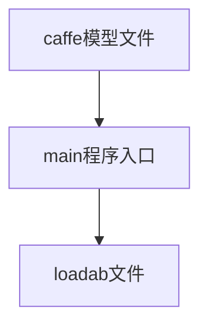
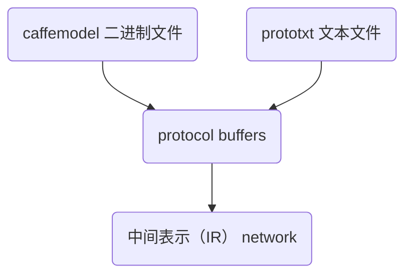

# 运行环境

|          | debug              | 最终运行    |
| -------- | ------------------ | ----------- |
| compiler | nvdla/vp           | linux ARM64 |
| rutime   | nvdla/vp  交叉编译 | linux ARM64 |
| driver   | nvdla/vp  交叉编译 | linux ARM64 |

## 编译器 compiler

### 编译

```shell
export TOP = ${umd 目录}
cd sw/umd
make compiler
```


### 运行

需要caffe 模型的两个文件 prototxt 及 caffemodel

```shell
./nvdla_compiler [-options] --prototxt <prototxt_file> --caffemodel <caffemodel_file> -o <outputpath>
```

生成 .nvdla 文件

## 运行时 runtime

### 编译

```shell
export TOP = {umd 目录}
export TOOLCHAIN_PREFIX={buildroot-root}/output/host/bin/aarch64-linux-gnu-*
export LD_LIBRARY_PATH={umd 目录}/out/core/src/runtime/libnvdla_runtime/
cd sw/umd
make runtime 
```

### 运行

```shell
加载驱动
insmod drm.ko
insmo opendla.ko
nvdla_runtime --loadable *.nvdla --image  images/digits/five.pgm  --normalize 1.0 --rawdump
```

# 代码阅读 compiler

## 输入

输入caffe 模型 输出

| Network &nbsp; &nbsp; &nbsp; &nbsp; &nbsp; &nbsp; &nbsp; &nbsp; &nbsp; &nbsp; &nbsp; &nbsp; &nbsp; &nbsp; &nbsp; &nbsp; &nbsp; | Configuration &nbsp; &nbsp; &nbsp; &nbsp; &nbsp; &nbsp; &nbsp; &nbsp; &nbsp; &nbsp; &nbsp; &nbsp; &nbsp; | fp16 &nbsp; &nbsp; &nbsp; &nbsp; &nbsp; &nbsp; &nbsp; &nbsp; &nbsp; | int8 &nbsp; &nbsp; &nbsp; &nbsp; &nbsp; &nbsp; &nbsp; &nbsp; &nbsp; |
| ------------------------------------------------------------ | ------------------------------------------------------------ | ------------------------------------------------------------ | ------------------------------------------------------------ |
| MNIST                                                        | nv_full,nv_large,nv_small                                    | Verified                                                     | Verified                                                     |
| ResNet-18                                                    | nv_full,nv_large,nv_small                                    | Verified                                                     | Verified                                                     |
| ResNet-50                                                    | nv_full,nv_large,nv_small                                    | Verified                                                     | Verified                                                     |




### 输入缺省值

```c++
static TestAppArgs defaultTestAppArgs =
{
    /* .project = */ "OpenDLA",
    /* .inputPath = */ "./",
    /* .inputName = */ "",
    /* .outputPath = */ "./",
    /* .testname = */ "",
    /* .testArgs = */ "",
    /* .prototxt = */ "",
    /* .caffemodel = */ "",
    /* .cachemodel = */ "",
    /* .profileName = */ "fast-math",
    /* .profileFile = */ "",
    /* .configtarget = */ TARGET_CONFIG_NAME,
    /* .calibtable = */ "",
    /* .quantizationMode = */ DEFAULT_QUANT_MODE,
    /* .numBatches = */ DEFAULT_BATCH_SIZE,
    /* .inDataFormat = */ DEFAULT_DATA_FMT,
    /* .computePrecision = */ nvdla::DataType::INT8
};
```

### caffe的prototxt

用于定义 caffe模型的网络结构，可以通过Netscope 对结构进行可视化，是由多层结构组成。

​	AlexNet

​	 http://dgschwend.github.io/netscope/#/gist/e65799e70358c6782b1b


### caffe 的caffemodel 

二进制文件

### 模型精度

INT8 默认值

INT16

## 输出

.loadable 文件

## 解析



### google protocol buffer

https://developers.google.com/protocol-buffers

## 量化

INT8量化范围 [-127,128]
